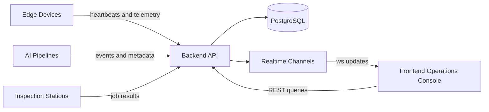

# Edge AI Ops Platform

Edge AI Ops Platform is a frontend-first starter for operator dashboards in IoT, edge AI, and industrial inspection environments.

## Why this repo exists

This project is designed to become a reusable platform base for:

- device fleet monitoring
- live telemetry views
- AI event review and filtering
- industrial inspection workflows
- operational dashboards with drill-down navigation

## What makes it different

The frontend is treated as the product surface, not as a thin layer on top of CRUD APIs.

That means the architecture prioritizes:

- information-dense layouts
- realtime state visibility
- clear domain modules
- typed contracts between backend and frontend
- local development that feels production-shaped

## System Direction

## First Milestone

The initial scaffold focuses on:

- repository identity
- documentation
- backend module layout
- frontend module layout
- Docker-based local setup
